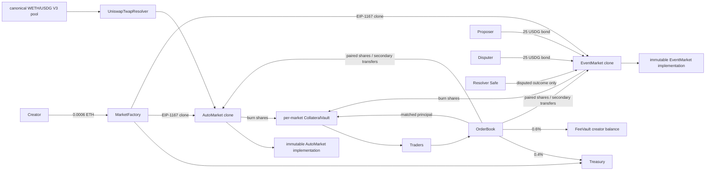

# One Shot

One Shot is a fully collateralized, permissionless YES/NO market protocol for Robinhood Chain mainnet (chain ID 4663). It supports arbitrary objectively resolvable event questions and deterministic automatic ETH/USDG price markets. Both market types use the same matched-order trading, fee, collateral, share, and redemption engine.

**Nothing has been deployed. This code has not received the independent security or legal reviews required for real-money use. Do not acknowledge those gates or accept deposits until the reviews have actually been completed.**

## Run and verify

Use Node.js 22 or 24 and npm:

```sh
npm ci --ignore-scripts
npm run lint
npm run build
npm test
npm run test:ui
npm run simulate
npm run simulate:fork
npm run audit:production
```

`simulate:fork` uses the configured private `RH_RPC_URL`, the pinned mainnet block, and a localhost transport proxy that splits RPC batches and respects the provider's ten-block log limit. It never broadcasts. The proxy does not log the upstream URL, credentials, request bodies, or response bodies.

Start the local app with `npm run dev`. Without `VITE_FACTORY_ADDRESS` and `VITE_DEPLOYMENT_BLOCK`, the UI remains read-only. Never put private RPC credentials, a keystore, or a password in a `VITE_*` variable because Vite values are public.

## Contracts



`MarketFactory` has no owner or mutators. Its token, treasury, automatic resolver, resolver multisig, proposal bond, dispute period, and two market implementation addresses are immutable. It accepts exactly 0.0006 ETH per creation and forwards all of it to treasury. The factory creates one shared `OrderBook` and `FeeVault`; every market gets its own `CollateralVault`.

`PredictionMarket` is the shared engine. It stores bounded market text and a deterministic combined commitment. The individual question, outcome, rule, source, and resolution-time commitments remain available as derived getters instead of duplicate storage. All fields are fixed during atomic clone initialization, before the market is registered or externally observable. It has no delete, edit, creator-resolution, collateral-withdrawal, pause, rescue, or upgrade path.

`AutoMarket` binds automatic terms to `UniswapTwapResolver`. `EventMarket` implements proposal, dispute, finalization, adjudication, bond settlement, and INVALID redemption. Their implementations are deployed once with initialization permanently locked. Shared USDG, order-book, resolver, Safe, bond, and dispute-period values are immutable implementation constants; per-market creator, timestamps, terms, metadata, positions, state, and collateral remain isolated in clone storage. The factory creates standard 45-byte EIP-1167 clones pointing to those fixed implementations and initializes each clone exactly once in the same transaction. There is no beacon, proxy admin, implementation setter, upgrade authority, or mutable implementation pointer.

## Trading and accounting

USDG has six decimals. Shares are whole integers and prices are cents from 1 through 99. A YES buy at `p` matches a NO buy at `100-p`; only matching quantities mint one fully backed YES/NO pair. A same-outcome buy can also match an exact-price secondary sell. There is no protocol or creator liquidity, prize pool, spread capture, market maker, or promise of an immediate exit.

The buyer pays principal plus exactly 1%. The book sends 0.4% to treasury and accrues 0.6% to the creator. Unfilled principal and its fee reserve are refundable on cancellation. Seller proceeds do not touch collateral. Before valid resolution each complete pair is backed by exactly 1 USDG. YES or NO winners redeem 1 USDG; on INVALID, both YES and NO redeem 0.5 USDG each. Creator claims, treasury fees, listing fees, proposal bonds, and dispute bonds cannot reduce collateral.

See [ACCOUNTING.md](docs/ACCOUNTING.md) for the exact equations and invariants.

## Automatic markets

The initial automatic builder exposes only canonical ETH/USDG, ABOVE_OR_EQUAL or BELOW, a whole-USDG threshold, close time, and resolution time. It does not accept arbitrary pools or tokens.

The resolver uses the arithmetic-mean Uniswap V3 tick for the immutable 60-minute interval ending at `resolvesAt`. A call seven minutes late still queries `[resolvesAt-3600, resolvesAt]`; spot price and call time are ignored. Missing historical observations leave the market pending rather than introducing a manual fallback.

Mainnet values revalidated live on 2026-08-31:

| Value | Address / setting |
| --- | --- |
| Chain ID | `4663` |
| USDG (6 decimals) | `0x5fc5360D0400a0Fd4f2af552ADD042D716F1d168` |
| WETH (18 decimals) | `0x0Bd7D308f8E1639FAb988df18A8011f41EAcAD73` |
| Uniswap V3 factory | `0x1f7d7550B1b028f7571E69A784071F0205FD2EfA` |
| WETH/USDG pool | `0x52e65B17fB6E5BA00Ed806f37Afcd2DaA50271Ca` |
| Pool fee | 100 |
| TWAP window | 3600 seconds |
| Pinned fork block | 51198521 |

Sources: [Robinhood network configuration](https://docs.robinhood.com/chain/connecting/), [Robinhood canonical contracts](https://docs.robinhood.com/chain/contracts/), and [Uniswap deployments for chain 4663](https://github.com/Uniswap/contracts/blob/main/deployments/4663.md). Runtime checks also require token metadata, pool token order, pool factory, liquidity, unlocked state, observation history, current block freshness, and archive access.

There is no Chainlink verifier, feed allowlist, Data Streams subscription, signed report, `STREAMS_API_KEY`, or `STREAMS_API_SECRET` dependency in this MVP.

## Event markets

A creator supplies a question, exact YES and NO meanings, category, close time, resolution time, deterministic rules, primary source, optional secondary source, and optional metadata URI. Required fields and length bounds are enforced onchain. The application displays an ambiguity warning but never uses AI or frontend judgment to resolve a market.

After `resolvesAt`, anyone may propose YES, NO, or INVALID with bounded evidence and the immutable protocol proposal bond (default 25 USDG). A different account may dispute within the immutable period (default 86,400 seconds) with the same bond and another outcome. If undisputed, anyone calls `finalize` after the full period and the proposer receives its bond back. A dispute can only be adjudicated by the immutable resolver address.

If the resolver chooses the proposal, the proposer receives both bonds. If it chooses the alternative, the disputer receives both. If it chooses the third outcome, each receives its own bond. Bonds stay in `EventMarket`, never enter the vault or fee stores, and settle once. INVALID is reserved for a question that cannot be determined under its immutable rules; it is not an admin cancellation power.

The production resolver must be an independently configured deployed Safe or equivalent contract. A 3-of-5 Safe is recommended. Its only protocol power is calling `adjudicate` on an already DISPUTED event market with YES, NO, or INVALID. It cannot edit metadata, resolve an undisputed market, trade, transfer shares, withdraw backing, claim fees, alter economics, or change deadlines.

## Deployment

Copy `.env.example` to `.env`. Before broadcast the operator supplies:

- `RH_RPC_URL`, `TREASURY_ADDRESS`, `DEPLOYER_ADDRESS`, and a deployed `RESOLVER_MULTISIG_ADDRESS`
- `EVENT_PROPOSAL_BOND_USDG=25` and `EVENT_DISPUTE_PERIOD=86400`
- only after independent review, the exact security and legal acknowledgements shown in `.env.example`
- only when the operator intentionally runs `--broadcast`, an encrypted keystore path and password from a secure secret manager

`npm run deploy` runs lint, compilation/build, all contract and browser tests, local simulation, production dependency audit, live mainnet validation, the pinned fork lifecycles, constructor generation, and gas calculation. Without `--broadcast`, it never reads a key or sends a transaction. There is no testnet, skip-checks, or force flag.

The launch sequence deploys `UniswapTwapResolver`, then the locked `AutoMarket` and `EventMarket` implementations bound to the predicted shared order book, then `MarketFactory`. The script records bytecode and constructor-data hashes, requires 30% gas headroom, records every receipt, and verifies the factory's immutable implementation, order-book, and configuration bindings after deployment.

Only an operator may later run:

```sh
npm run deploy -- --broadcast
```

Do not do that until every applicable item in [LAUNCH_CHECKLIST.md](docs/LAUNCH_CHECKLIST.md) is independently completed. After deployment, verify sources and constructor arguments on Blockscout before setting public frontend variables or accepting deposits.

## Trust and operations

The contracts cannot make a free-form real-world source truthful. Users trust the immutable rules, cited sources, and the resolver Safe for disputed event markets. Automatic users trust Robinhood Chain, canonical USDG/WETH, the selected Uniswap pool, and the availability/manipulation resistance of its historical observations. USDG issuer controls, RPC/sequencer availability, thin liquidity, immutable bugs, frontend censorship, Safe compromise, ambiguous questions, and legal restrictions remain external risks.

Application moderation may hide spam or unlawful content by jurisdiction, but it is not settlement authority and cannot mutate onchain terms. A read-only indexer may improve search and categories; all transactions and outcomes remain contract-authoritative. See [SECURITY.md](docs/SECURITY.md), [INDEXING.md](docs/INDEXING.md), and [LAUNCH_CHECKLIST.md](docs/LAUNCH_CHECKLIST.md).
