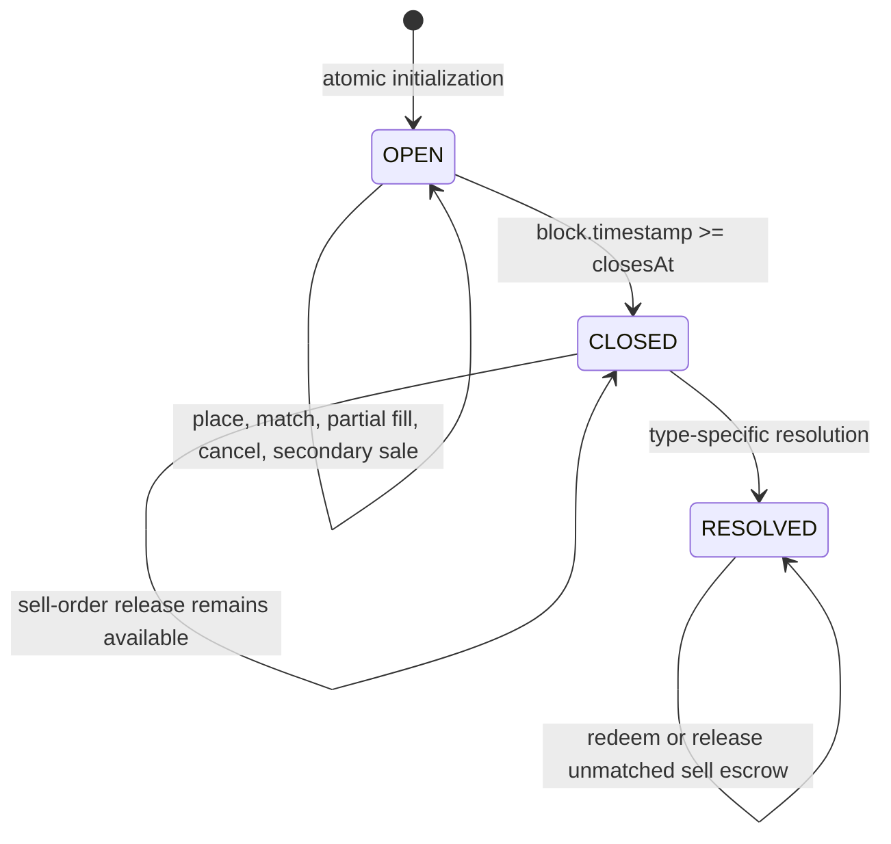
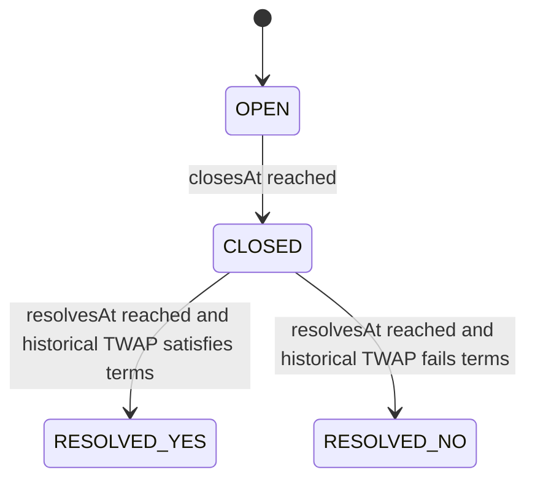

# State machines

## Shared trading state

Trading requires the stored state to be OPEN, no final outcome and `block.timestamp < closesAt`. The view state reports CLOSED once the timestamp boundary is reached. Cancelling or releasing sell escrow remains possible after close/resolution so shares cannot be stranded in OrderBook.

## AUTO

AUTO has no proposal, dispute, Safe adjudication, INVALID, manual override or spot-price route. If history is unavailable, it remains CLOSED/unresolved.

## EVENT

```mermaid
stateDiagram-v2
  [*] --> OPEN
  OPEN --> CLOSED: closesAt reached
  CLOSED --> PROPOSED: resolvesAt reached; valid proposal plus bond
  PROPOSED --> RESOLVED_YES: deadline passed; permissionless finalize YES
  PROPOSED --> RESOLVED_NO: deadline passed; permissionless finalize NO
  PROPOSED --> RESOLVED_INVALID: deadline passed; permissionless finalize INVALID
  PROPOSED --> DISPUTED: timely alternative plus bond
  DISPUTED --> RESOLVED_YES: Resolver Safe
  DISPUTED --> RESOLVED_NO: Resolver Safe
  DISPUTED --> RESOLVED_INVALID: Resolver Safe
```

There are no reverse transitions. Proposal and dispute are single-use. Final outcome is single-use. Redemptions burn the caller’s selected shares, so repeated redemption cannot reuse the same balance.

## Order state

An order begins with `filled = 0` and `cancelled = false`. Each fill requires an active order, nonexpired deadline, compatible market/side/price and positive quantity not exceeding the remainder. A cancellation sets the terminal flag before refund/release. An order is terminal when cancelled or fully filled. Order IDs are monotonically allocated and cannot be replayed as new orders.
