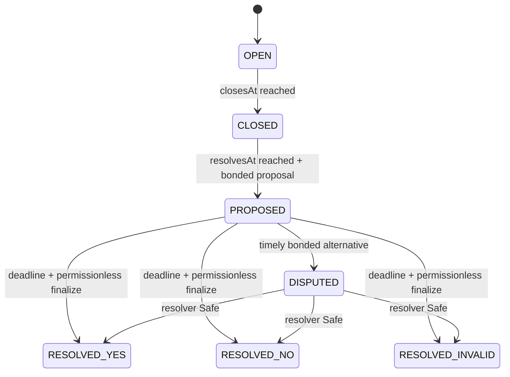

# Security review package

This repository has not received an independent audit, formal verification, economic audit, public bug bounty, or legal approval. Tests and fork simulations are evidence about implemented behavior, not substitutes for those reviews.

## Authority graph

| Actor | Allowed | Explicitly unavailable |
| --- | --- | --- |
| Market creator | Pay listing fee, define immutable terms, trade, propose/dispute like any user, claim its 0.6% fee | Edit/delete terms, declare an outcome, lower bonds, withdraw backing, claim protocol fees |
| Trader | Place/match/cancel orders, trade shares, propose/dispute events, resolve automatic markets, finalize undisputed events, redeem | Mint without matched collateral, double fill/redeem, move another user's shares, withdraw vault funds |
| Treasury | Receive listing fee and 0.4% matched-trade fee | Mutate terms, resolve markets, claim creator fees, withdraw collateral/bonds/orders |
| Resolver Safe | Call `adjudicate(YES/NO/INVALID)` on an already DISPUTED event | Resolve automatic/undisputed events, edit terms, move tokens or shares, touch vault/book/fee accounting |
| Frontend/indexer | Filter visibility and present derived data | Change contracts, metadata commitments, balances, state, or outcomes |

There is no owner, proxy admin, upgrade key, pause key, arbitrary call, rescue transfer, or collateral sweep. Every production dependency and economic parameter is immutable.

## Fund flows and separation

1. Creation sends exactly 0.0006 ETH directly from factory to treasury. Failure reverts creation.
2. A buy escrows principal and an unearned 1% reserve in `OrderBook`. Cancellation returns the unfilled amounts.
3. Opposite buys fund exactly 1 USDG per pair in that market's `CollateralVault`. The book separately sends 0.4% of filled notional to treasury and 0.6% to `FeeVault`.
4. A secondary sale transfers buyer principal to the seller, fees to their destinations, and escrowed shares to the buyer. Vault backing does not move.
5. Event proposal/dispute bonds transfer to that `EventMarket`; its `bondEscrowed` liability is separate from shares, the vault, the book, and the fee vault.
6. Redemption burns shares before `CollateralVault` releases the exact YES/NO or INVALID payout.

Incoming token transfers verify the exact balance increase, rejecting fee-on-transfer behavior. OpenZeppelin `SafeERC20` checks return semantics. Externally callable token-moving paths use reentrancy guards and update liabilities before outgoing transfers.

## Immutable values and commitments

Factory immutables: USDG, treasury, automatic resolver, resolver multisig, event proposal bond, dispute period, the two locked market implementations, FeeVault, and OrderBook. Resolver immutables: WETH, USDG, pool, pool fee observed at construction, and TWAP window. Implementation immutables bind the token, settlement book and type-specific resolver parameters. Each clone records creator, market type, close/resolution time, bounded metadata, combined metadata hash, positions, state and type-specific terms during its single atomic initialization; no later mutation surface exists for resolution terms or metadata.

Text is stored onchain and emitted through creation/proposal/dispute events. Hashes use `keccak256(bytes(field))`; the resolution-time commitment is `keccak256(abi.encode(resolvesAt))`; the combined hash uses deterministic ABI encoding of all protected hashes and the metadata URI hash. Immutability begins at creation, before any trade.

## State transitions

Automatic markets move from OPEN to CLOSED by time and then directly to RESOLVED_YES or RESOLVED_NO through the bound module. The module queries the fixed historical interval. There is no INVALID/manual automatic path.

Tests reject pre-time proposals/resolution, post-close trades, late disputes, same-outcome disputes, duplicate proposal/finalization/redemption, unauthorized adjudication, adjudication outside DISPUTED, overlong metadata/evidence, invalid token/pool/configuration, double fills, expired orders, replayed order IDs, and reentrant transfer callbacks.

## Oracle and resolution assumptions

Automatic resolution trusts Robinhood Chain execution/finality, the canonical WETH and USDG contracts, the canonical Uniswap V3 factory, and the selected WETH/USDG pool. Arithmetic-mean tick TWAP reduces short spot manipulation but cannot eliminate manipulation of a thin pool over the full hour. Observation availability and pool/token behavior can strand resolution. The resolver intentionally has no owner, setter, spot fallback, API, Chainlink, or manual override.

Event resolution trusts creators to write objective terms and users to assess them. An uncontested wrong proposal can finalize. Watchers must monitor every proposal during the full dispute window and have USDG available. Disputed outcomes trust the Safe signers, their evidence process, key security, availability, and conflicts policy. A compromised threshold can choose YES, NO, or INVALID for a disputed market, but cannot steal backing directly. Safe signers should use independent keys, documented source precedence, public reasoning, conflict recusal, and an incident process.

## Attack surfaces and known risks

1. **Ambiguous or malicious questions.** Bounds prevent storage/gas abuse, not semantic deception. The UI warning is advisory. Frontend filtering can hide content but cannot rewrite settlement.
2. **Optimistic monitoring.** A bad proposal wins if no one disputes it. Monitoring, redundant watchers, adequate bonds, and alerting are launch requirements.
3. **Resolver capture or unavailability.** A compromised Safe threshold controls disputed outcomes; an unavailable Safe strands them. Use a real reviewed 3-of-5 Safe with independent custody.
4. **TWAP liquidity/manipulation.** The one-hour historical TWAP is only as robust as pool liquidity and observation integrity. Review economic manipulation cost and monitor liquidity.
5. **USDG issuer controls.** Pause, blacklist, upgrade, confiscation, or transfer changes can block trading, refunds, bonds, fees, or redemption despite contract solvency.
6. **No emergency admin.** Immutability prevents administrative theft but also prevents patches and forced recovery. A bug requires stopping interfaces and using a reviewed replacement for future markets.
7. **Execution/liquidity.** Exact-price matching may be sparse. Ordering/front-running affects fills. Same-address self-match is blocked; multi-address wash trading remains possible. Volume is not a security signal.
8. **Metadata links.** Sources/evidence can disappear or serve harmful content. Clients must render text safely and never execute linked content. Onchain hashes preserve commitments, not availability.
9. **RPC/indexing.** Missing history can yield incorrect UI projections. The client must fail closed on incomplete scans and confirm state directly before a transaction.
10. **Deployment/supply chain.** Four sequential launch transactions are non-atomic. Nonce changes break predicted factory bindings. Review lockfile, compiler, bytecode hashes, constructor hashes, partial manifests, and verified source.
11. **Legal exposure.** Permissionless political, sports, company, and cultural markets can have materially different regulation. The contracts do not implement licensing, KYC, sanctions, age, geofencing, tax, consumer, or market-integrity controls.

## Review targets

Independent reviewers should prioritize collateral conservation, all three bond settlement branches, INVALID exactness, order partial fills/cancellation, token callback/reentrancy behavior, state boundaries at exact timestamps, resolver authorization, metadata encoding commitments, Uniswap tick rounding/decimal orientation/historical query times, factory/deployer address binding, EIP-170 sizes, and deployment nonce recovery.

Before public launch publish a maintained security contact, disclosure policy, incident plan, exact reviewed source hash, verified addresses/constructors, Safe signer policy, and monitoring endpoints. Do not represent the acknowledgements as audit or legal evidence.
